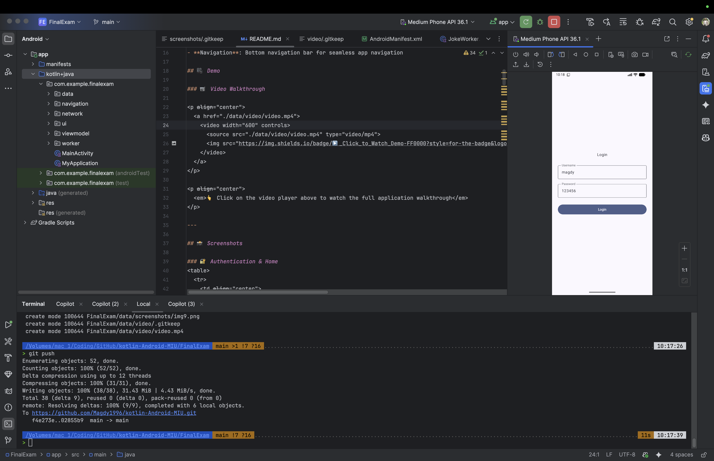
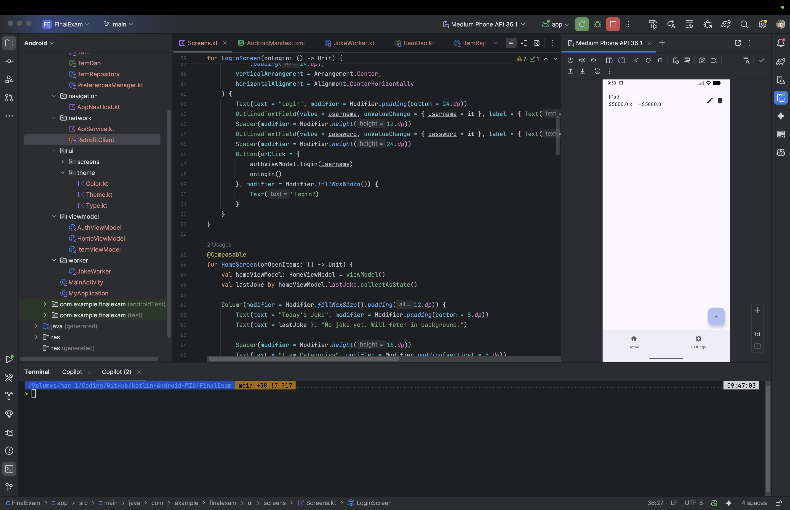
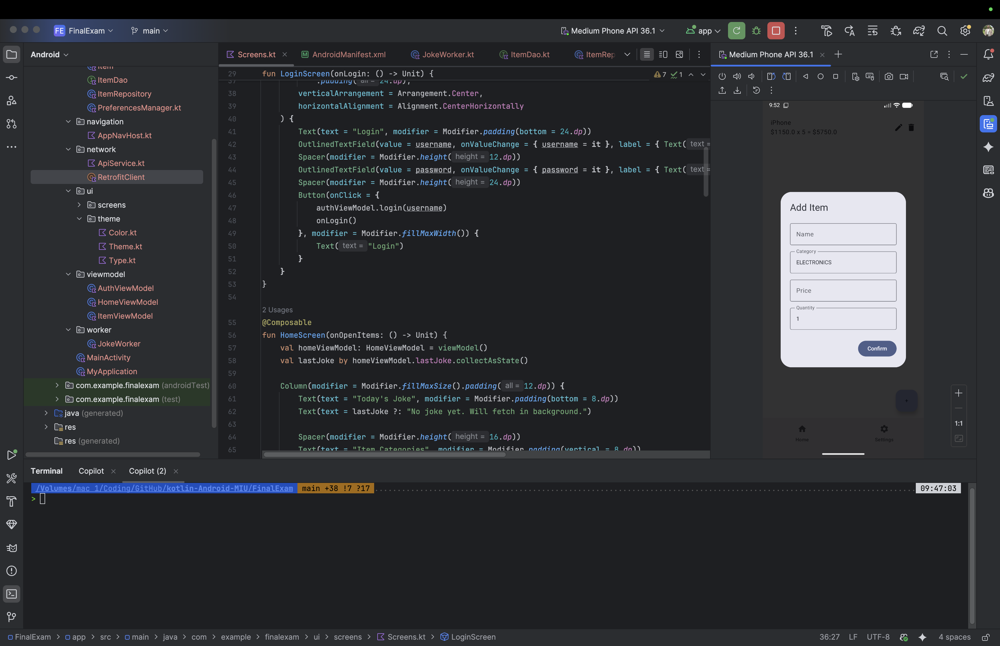
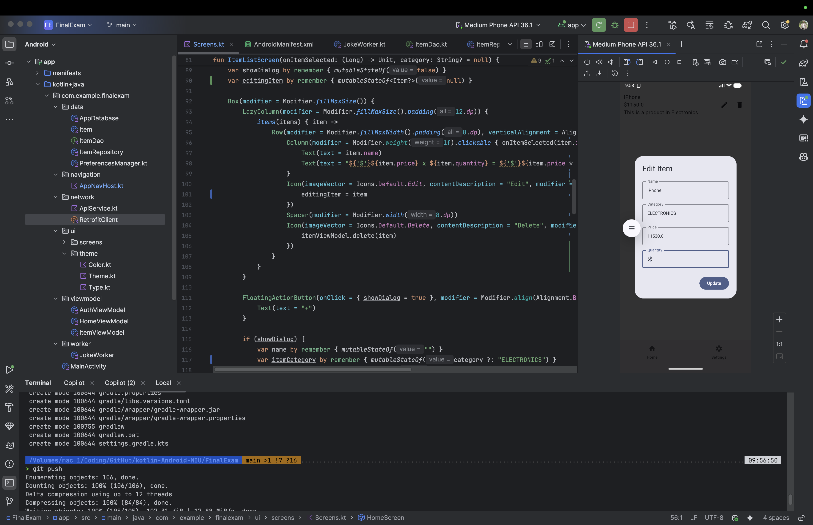
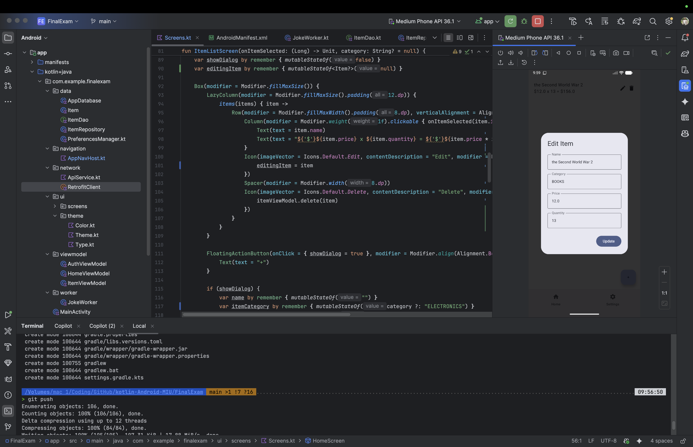
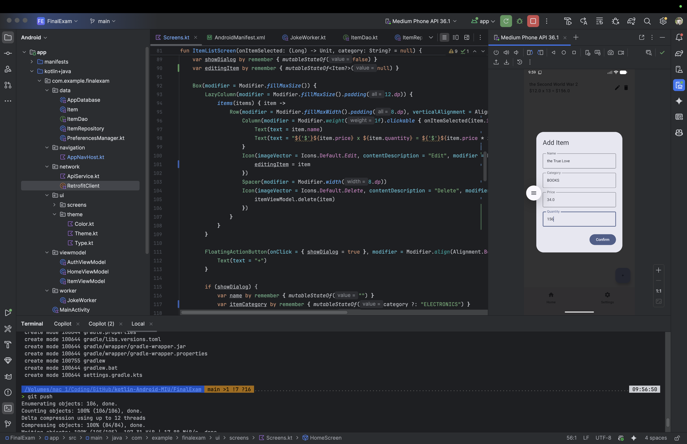
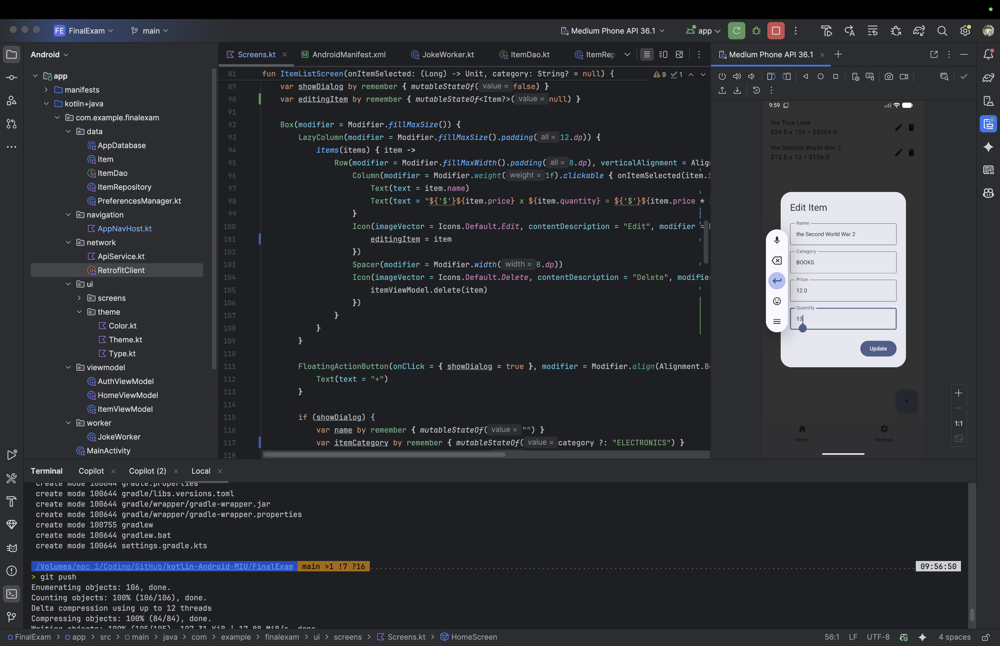
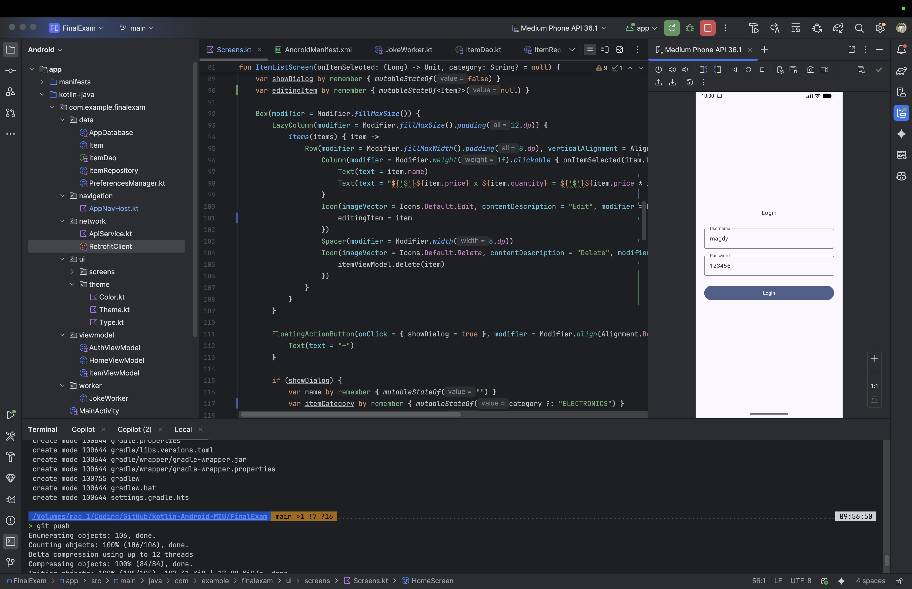

# Inventory Management App - Android Final Exam

A modern Android application built with Kotlin and Jetpack Compose for managing inventory items across different categories. The app features user authentication, real-time data persistence, and background joke fetching.

## 📱 Features

- **User Authentication**: Secure login system with persistent user sessions using DataStore
- **Inventory Management**: Full CRUD operations for items (Create, Read, Update, Delete)
- **Category-based Organization**: Items organized into three categories:
  - Electronics
  - Clothing
  - Books
- **Real-time Updates**: Local database with Room for instant data synchronization
- **Background Worker**: Fetches daily jokes using WorkManager every 30 minutes
- **Modern UI**: Built entirely with Jetpack Compose and Material Design 3
- **Navigation**: Bottom navigation bar for seamless app navigation

## 🎥 Demo

### 📹 Video Walkthrough

<p align="center">
  <a href="https://drive.google.com/file/d/1uNsrWLUt5mKaa-NUUY081PwCxIl9bBjr/view?usp=sharing" target="_blank">
    
  </a>
</p>

<p align="center">
  <a href="https://drive.google.com/file/d/1uNsrWLUt5mKaa-NUUY081PwCxIl9bBjr/view?usp=sharing" target="_blank">
    
  </a>
</p>

<p align="center">
  <strong>
    <a href="https://drive.google.com/file/d/1uNsrWLUt5mKaa-NUUY081PwCxIl9bBjr/view?usp=sharing" target="_blank">
      🎬 Click on the thumbnail or badge above to watch the full demo video
    </a>
  </strong>
</p>

---

## 📸 Screenshots

### 🔐 Authentication & Home
<table>
  <tr>
    <td align="center">
      <br />
      <sub><b>Login Screen</b></sub>
    </td>
    <td align="center">
      <br />
      <sub><b>Home Screen</b></sub>
    </td>
    <td align="center">
      <br />
      <sub><b>Categories</b></sub>
    </td>
    <td align="center">
      <br />
      <sub><b>Category View</b></sub>
    </td>
  </tr>
</table>

### 📦 Item Management - Part 1
<table>
  <tr>
    <td align="center">
      <br />
      <sub><b>Items List</b></sub>
    </td>
    <td align="center">
      <br />
      <sub><b>Add Item</b></sub>
    </td>
    <td align="center">
      <br />
      <sub><b>Edit Item</b></sub>
    </td>
    <td align="center">
      <br />
      <sub><b>Item Actions</b></sub>
    </td>
  </tr>
</table>

### 🔍 Item Details & Operations
<table>
  <tr>
    <td align="center">
      <br />
      <sub><b>Item Details</b></sub>
    </td>
    <td align="center">
      <br />
      <sub><b>Update Item</b></sub>
    </td>
    <td align="center">
      <br />
      <sub><b>Delete Confirm</b></sub>
    </td>
    <td align="center">
      <br />
      <sub><b>Category Filter</b></sub>
    </td>
  </tr>
</table>

### ⚙️ Settings & More
<table>
  <tr>
    <td align="center">
      <br />
      <sub><b>Settings Screen</b></sub>
    </td>
    <td align="center">
      <br />
      <sub><b>Joke Display</b></sub>
    </td>
    <td align="center">
      <br />
      <sub><b>Navigation</b></sub>
    </td>
    <td align="center">
      <br />
      <sub><b>App Overview</b></sub>
    </td>
  </tr>
</table>

---

## 🏗️ Architecture

The app follows the **MVVM (Model-View-ViewModel)** architecture pattern with a clean separation of concerns:

```
app/
├── data/               # Data layer
│   ├── Item.kt        # Entity model
│   ├── ItemDao.kt     # Room DAO
│   ├── AppDatabase.kt # Database instance
│   ├── ItemRepository.kt
│   └── PreferencesManager.kt
├── network/           # Network layer
│   ├── RetrofitClient.kt
│   └── JokeApi.kt
├── viewmodel/         # ViewModels
│   ├── AuthViewModel.kt
│   ├── HomeViewModel.kt
│   └── ItemViewModel.kt
├── ui/
│   ├── screens/       # Compose screens
│   │   └── Screens.kt
│   └── theme/         # Material theme
├── navigation/        # Navigation setup
│   └── AppNavHost.kt
├── worker/           # Background workers
│   └── JokeWorker.kt
└── MyApplication.kt  # Application class
```

## 🛠️ Tech Stack

### Core
- **Language**: Kotlin
- **UI Framework**: Jetpack Compose
- **Minimum SDK**: 24 (Android 7.0)
- **Target SDK**: 36

### Libraries & Dependencies

#### UI & Navigation
- Jetpack Compose (Material 3)
- Navigation Compose
- Activity Compose

#### Database
- Room Database
  - Room Runtime
  - Room KTX
  - Room Compiler (KAPT)

#### Networking
- Retrofit 2
- Gson Converter
- OkHttp3
- OkHttp Logging Interceptor

#### Background Tasks
- WorkManager

#### Data Persistence
- DataStore Preferences

#### Async Operations
- Kotlin Coroutines
- Kotlin Flows

#### Testing
- JUnit
- Espresso
- Compose UI Testing

## 📦 Installation

### Prerequisites
- Android Studio Ladybug (2024.2.1) or later
- JDK 11 or higher
- Android SDK with API level 24+

### Steps

1. **Clone the repository**
   ```bash
   git clone https://github.com/yourusername/kotlin-Android-MIU.git
   cd kotlin-Android-MIU/FinalExam
   ```

2. **Open in Android Studio**
   - Launch Android Studio
   - Select "Open an Existing Project"
   - Navigate to the FinalExam folder

3. **Sync Gradle**
   - Wait for Gradle to sync automatically
   - If needed, click "Sync Now" in the notification bar

4. **Run the app**
   - Connect an Android device or start an emulator
   - Click the Run button (▶️) or press `Shift + F10`

## 🎮 Usage

### Login
- Default credentials:
  - **Username**: `magdy`
  - **Password**: `123456`

### Managing Items
1. **View Categories**: From the home screen, tap any category to view items
2. **Add Item**: Click the floating "+" button and fill in the details
3. **Edit Item**: Tap the edit icon next to any item in the list
4. **Delete Item**: Tap the delete icon next to any item
5. **View Details**: Tap on an item name to see full details

### Categories
- **ELECTRONICS**: TVs, phones, laptops, etc.
- **CLOTHING**: Shirts, pants, shoes, etc.
- **BOOKS**: Novels, textbooks, magazines, etc.

## 🔧 Configuration

### Database
The app uses Room database with automatic migrations disabled. Data is stored locally on the device.

### Background Tasks
The JokeWorker fetches jokes every 30 minutes. Modify the interval in `MyApplication.kt`:

```kotlin
val workRequest = PeriodicWorkRequestBuilder<JokeWorker>(30, TimeUnit.MINUTES)
```

### API Integration
The app fetches jokes from: `https://official-joke-api.appspot.com/random_joke`

## 📝 Key Features Implementation

### 1. Authentication with DataStore
- Persistent login state across app restarts
- Secure credential storage
- Automatic navigation based on authentication status

### 2. Room Database Integration
- Local-first architecture
- Reactive data updates with Flows
- Efficient CRUD operations

### 3. Category Filtering
- Dynamic item filtering by category
- Category-specific item addition
- Seamless navigation between categories

### 4. Background Work
- Periodic joke fetching using WorkManager
- Persists jokes in DataStore
- Displays on home screen

### 5. Modern UI with Compose
- Declarative UI programming
- Material Design 3 components
- Responsive layouts

## 🐛 Troubleshooting

### Build Issues
If you encounter build errors:
```bash
./gradlew clean
./gradlew build
```

### Database Issues
To reset the database, clear app data:
- Settings → Apps → Inventory Management App → Storage → Clear Data

### KAPT Issues
Ensure KAPT plugin is applied in `build.gradle.kts`:
```kotlin
id("org.jetbrains.kotlin.kapt")
```

## 📄 License

This project is created as a final exam submission for MIU (Maharishi International University).

## 👨‍💻 Author

**Student Name**: [Your Name]  
**Course**: Android Development with Kotlin  
**Institution**: Maharishi International University  
**Date**: October 2025

## 🙏 Acknowledgments

- MIU Android Development Course
- Jetpack Compose Documentation
- Material Design Guidelines
- Official Joke API

## 📞 Contact

For questions or feedback, please reach out:
- Email: [your-email@example.com]
- GitHub: [@yourusername](https://github.com/yourusername)

---

**Note**: This is an educational project created for academic purposes.
